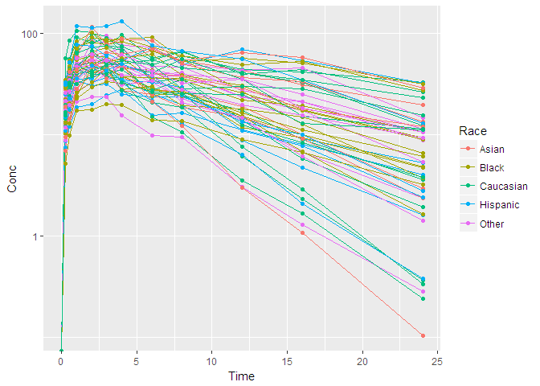

R package: pharmavis
================
Sungpil Han

# Introduction

Installation can be done by running the script below.

``` r
# devtools::install_github('asancpt/pharmavis')
library(pharmavis)
```

Here are some
examples.

``` r
plot_nca(concData = Theoph, colSubj = "Subject", colTime = "Time", colConc = "conc")
```

<!-- -->

``` r
plot_nca(concData = Indometh, colSubj = "Subject", colTime = "time", colConc = "conc")
```

<!-- -->

## Future references

여기서 예제를 올리고 이를 응용해서 PK plot을 그려 나갈 예정입니다.

``` r
ggplot2::qplot(x=Time, y=Conc, group=ID, color = Race, 
               data=PKPDdatasets::sd_oral_richpk, 
               log = 'y',
               geom=c('line', 'point'))
```

<!-- -->

``` r
ggplot2::qplot(x=Time, y=Conc, group=ID, color = Race, 
               data=PKPDdatasets::sd_oral_richpk, 
               facets = Race ~ Gender,
               geom=c('line', 'point'))
```

<!-- -->
